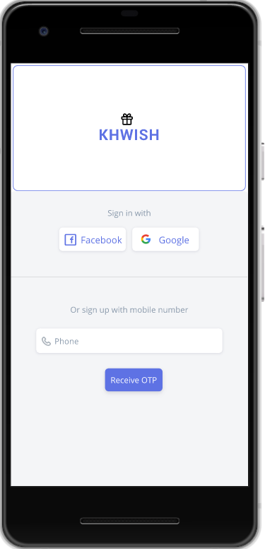
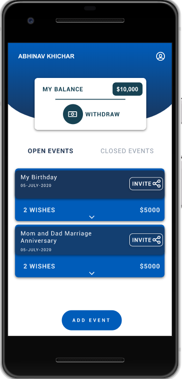
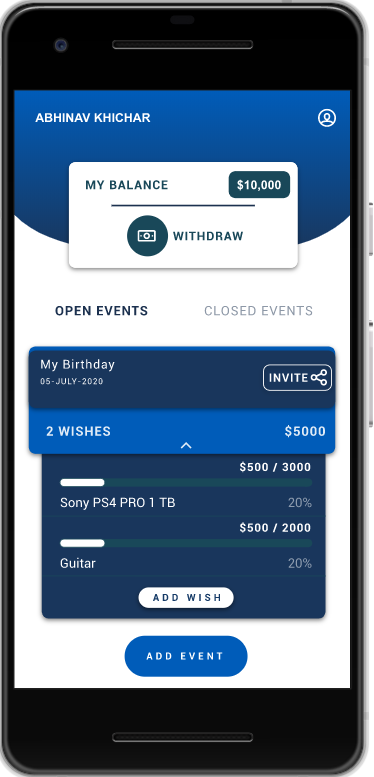
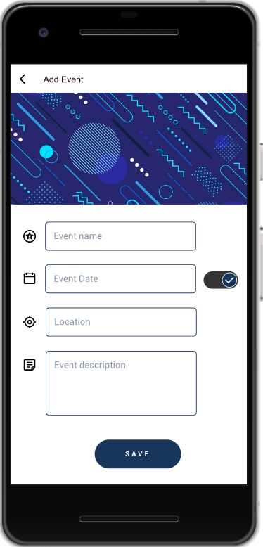
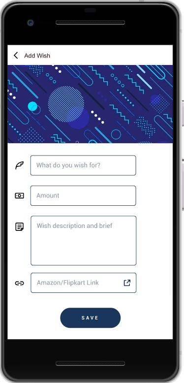
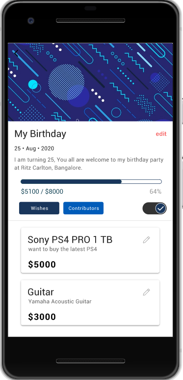
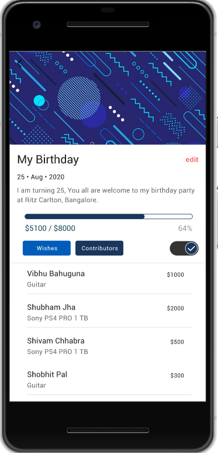
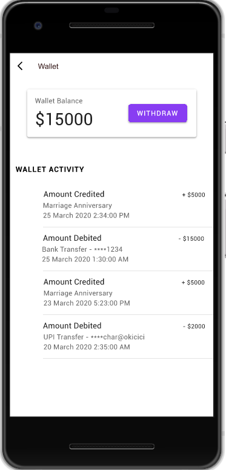
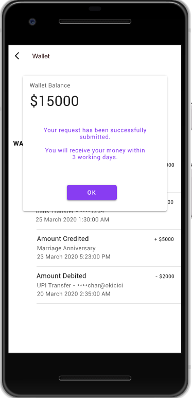

## Khwish-app
This is an Android app written in Java.
This is the users' frontend for the Khwish platform, which does the following tasks:
- User login & signup via Google, Facebook, and Phone Number using Firebase integration
- User onboarding, which includes capturing profile details and bank details for withdrawal in the future
- Add/Edit/Close Events and do the same for goals/wishes inside those events
- Share contribution links for the events with family, friends and their community.
- Monitor Events & wish's contributions
- Monitor overall wallet balance and activities & submit a withdrawal request
- Manage User Profile
- Notifications on contributions
- Firebase Integration for Analytics
- API interaction using Retrofit2

### Login Activity

  

### Home Activity

  

### Event Activity

  

### Wallet Activity

Please feel free to check out the codebase and let me know if you have any suggestions/improvements.

This was a part of the Khwish project, which I created in early 2020. Please read about it [here](https://gist.github.com/2sjha/b9012f396290bf3b8ebfc2b89fcd01c4). Khwish platform was discontinued around mid 2020; I'm no longer actively working on this project.
